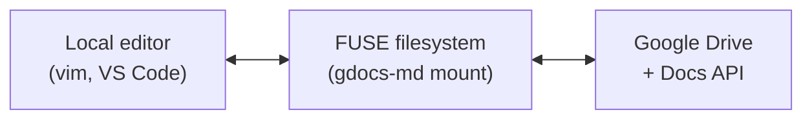

# gdocs-md

Mount Google Drive as a local FUSE filesystem where Google Docs appear as editable Markdown files. Edit a `.md` file on your machine and the changes sync back to Google Docs, preserving formatting like headings, bold, italic, lists, tables, and code blocks.

Other file types (PDFs, images, etc.) are accessible as read-only pass-through files.

## How it works

gdocs-md uses [FUSE](https://en.wikipedia.org/wiki/Filesystem_in_Userspace) to present a Google Drive folder as a regular directory on your machine. When you open a Google Doc, gdocs-md fetches it via the Google Docs API, converts the structured document to Markdown, and returns it as a `.md` file. When you save, the Markdown is parsed back into Google Docs API requests that update the document in place.



### File type mapping

| Google Drive type | Appears as | Read | Write |
|---|---|---|---|
| Google Docs | `filename.md` | Converted to Markdown | Markdown parsed back to Doc |
| Folders | `directory/` | Directory listing | Create/delete supported |
| PDFs | `filename.pdf` | Binary download | No |
| Images | `filename.png` | Binary download | No |
| Other files | `filename.ext` | Binary download | Binary upload |

### Markdown conversion

The following formatting round-trips between Markdown and Google Docs:

- Headings (`#` through `######`)
- **Bold**, *italic*, ~~strikethrough~~
- Inline `code` and fenced code blocks
- Ordered and unordered lists (with nesting)
- Links and images
- GFM-style tables
- Horizontal rules

Monospace-font paragraphs in Google Docs (Courier New, Consolas, etc.) are detected and wrapped in fenced code blocks automatically.

### Caching

gdocs-md caches both metadata and file contents in memory to keep reads fast:

- **Metadata cache** (default 30s TTL): directory listings and file stats
- **Content cache** (default 60s TTL, 100MB LRU): file contents

Writes are write-through — the cache and Google Drive are updated together. Repeated reads of the same file resolve in under 200ms.

### Error handling

- **Network errors**: return I/O error to the filesystem, log the issue, keep cached data
- **Auth errors**: return permission denied, prompt re-authentication
- **Rate limiting** (HTTP 429/5xx): exponential backoff with jitter, up to 5 retries
- **Concurrent edits**: last write wins (with a warning logged)

## Requirements

- **Go 1.25+** (for building from source)
- **FUSE**: macOS includes FUSE support natively; on Linux, install `libfuse-dev` (or `fuse3`)
- **Google Cloud project** with OAuth 2.0 credentials (see [Setup](#setup) below)

## Installation

### From source

```bash
# Clone and build
git clone <repo-url>
cd gdocs-md

# Build (outputs to bin/gdocs-md)
./scripts/build.sh

# Or install to $GOPATH/bin (or /usr/local/bin)
./scripts/install.sh
```

The build script embeds the git tag, commit hash, and build timestamp into the binary.

### Manual build

```bash
go build -o gdocs-md ./cmd/gdocs-md
```

## Setup

### 1. Create Google Cloud credentials

1. Go to the [Google Cloud Console](https://console.cloud.google.com/)
2. Create a new project (or select an existing one)
3. Enable the **Google Drive API** and **Google Docs API**
4. Go to **Credentials** > **Create Credentials** > **OAuth 2.0 Client ID**
5. Select **Desktop application** as the application type
6. Download the credentials JSON file

### 2. Save credentials

```bash
mkdir -p ~/.config/gdocs-md
cp ~/Downloads/client_secret_*.json ~/.config/gdocs-md/credentials.json
```

### 3. Authenticate

```bash
gdocs-md auth
```

This opens an OAuth consent screen in your browser. Grant access and paste the authorization code back into the terminal. The token is saved to `~/.config/gdocs-md/token.json` with 0600 permissions. Tokens refresh automatically.

**Scopes requested:**
- `drive.file` — edit files created or opened by the app
- `drive.readonly` — read all Drive files
- `documents` — read and edit Google Docs

## Usage

### Mount a Drive folder

```bash
# Get the folder ID from the Google Drive URL:
# https://drive.google.com/drive/folders/FOLDER_ID_HERE
gdocs-md mount <folder-id> <mountpoint>
```

Example:

```bash
mkdir -p ~/drive
gdocs-md mount 1aBcDeFgHiJkLmNoPqRsTuVwXyZ ~/drive
```

The folder contents appear at `~/drive/`. Google Docs show up as `.md` files.

### Edit a Google Doc

```bash
# Open in your editor
vim ~/drive/meeting-notes.md

# Or use any tool that reads/writes files
cat ~/drive/project-plan.md
echo "## New Section" >> ~/drive/draft.md
```

### Create a new Google Doc

```bash
# Any new .md file becomes a Google Doc
echo "# My New Document" > ~/drive/new-doc.md
```

### Delete a file

```bash
rm ~/drive/old-notes.md  # Moves to Drive trash
```

### Unmount

Press `Ctrl+C` in the terminal, or:

```bash
# macOS
umount ~/drive

# Linux
fusermount -u ~/drive
```

### Options

```
gdocs-md mount [flags] <folder-id> <mountpoint>

Flags:
  --cache-size string   Max in-memory cache size (default "100MB")
  --cache-ttl duration  Content cache TTL (default 60s)
  --meta-ttl duration   Metadata cache TTL (default 30s)
  --foreground          Run in foreground, don't daemonize
  --read-only           Mount as read-only
  -v, --verbose         Enable verbose logging
```

Examples:

```bash
# Large cache, longer TTL for slow connections
gdocs-md mount --cache-size 1GB --cache-ttl 5m abc123 ~/drive

# Read-only mount with verbose logging
gdocs-md mount --read-only --verbose abc123 ~/drive

# Foreground mode for debugging
gdocs-md mount --foreground --verbose abc123 ~/drive
```

### Check version

```bash
gdocs-md version
# gdocs-md version v1.0.0 (commit: abc1234, built: 2025-03-12T10:30:00Z)
```

## Architecture

gdocs-md is built in three layers:

**CLI** (`internal/cli/`) — Cobra-based command parsing, signal handling, and flag definitions.

**ragfs** (`internal/ragfs/`) — A reusable FUSE filesystem framework. Defines a `Handler` interface that any cloud storage backend can implement. Manages the FUSE server lifecycle, in-memory caching (TTL + LRU), and FUSE node operations (Dir and File types).

**Google Drive backend** (`internal/gdrive/`) — Implements the ragfs `Handler` interface. Handles OAuth, Google Drive API v3 calls, path-to-file-ID resolution with caching, and coordinates the markdown converter.

**Converter** (`internal/converter/`) — Bidirectional conversion between Google Docs API document structures and Markdown. Uses the goldmark parser for Markdown-to-Docs and a custom walker for Docs-to-Markdown.

The ragfs `Handler` interface:

```go
type Handler interface {
    List(ctx context.Context, path string) ([]Entry, error)
    Read(ctx context.Context, path string) ([]byte, error)
    Write(ctx context.Context, path string, data []byte) error
    Delete(ctx context.Context, path string) error
    Rename(ctx context.Context, oldPath, newPath string) error
    Stat(ctx context.Context, path string) (*Entry, error)
    Create(ctx context.Context, path string, isDir bool) (*Entry, error)
}
```

This abstraction means gdocs-md's FUSE layer could be reused for other cloud storage backends by implementing a different Handler.

## Development

```bash
# Run tests
go test ./...

# Run tests with race detector
go test -v -race ./...

# Build
./scripts/build.sh
```
